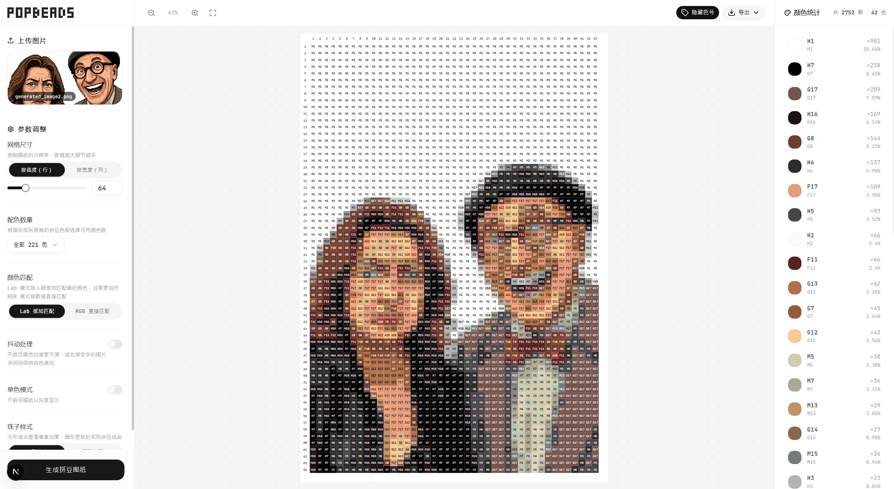

<div align="center">

# Popbeads

**将任意图片转换为拼豆手工图纸的开源工具**

[](LICENSE)
[](https://www.python.org)
[](https://nextjs.org)
[](https://fastapi.tiangolo.com)

上传 JPG / PNG / WEBP 图片 → 自动匹配 221 种 Mard 官方拼豆色 → 生成带色号标注的 SVG 矢量图纸 + 颜色用量统计

[快速开始](#-快速开始) · [功能特性](#-功能特性) · [API 文档](#-api-文档) · [项目结构](#-项目结构) · [部署](#-部署) · [贡献指南](#-贡献)

</div>

---

## 📸 截图



## ✨ 功能特性

### 核心能力

| 功能                   | 说明                                                                     |
| ---------------------- | ------------------------------------------------------------------------ |
| 🎨 **Lab 感知色彩匹配** | 基于 CIE Lab 色彩空间计算感知距离，比 RGB 欧氏距离更贴合人眼             |
| 🔢 **221 色官方色卡**   | 内置 Mard 拼豆全系列色卡（A–M 系），支持按套装筛选（24/36/48/72/120 色） |
| 📐 **自动比例计算**     | 指定行数或列数，另一维按原图比例自动推算                                 |
| 🖼️ **SVG 矢量输出**     | 图纸为无损矢量格式，支持无限缩放，适合打印                               |
| 📊 **颜色用量统计**     | 每种颜色的色号、名称、用量、占比一目了然                                 |
| 📱 **响应式设计**       | 桌面端三栏布局 + 独立移动端界面，自动适配                                |

### 高级功能

- **Floyd-Steinberg 抖动** — 渐变过渡更自然
- **单色（灰度）模式** — ITU-R BT.601 标准灰度转换
- **智能调色板缩减** — K-Means 聚类分析主色调，自动筛选最相关的拼豆色子集
- **合并相似颜色** — 量化后将 ΔE 接近的颜色合并，减少零星颜色种类，简化采购
- **像素风格化** — Canny 边缘检测 + HSL 自适应描边，照片呈现像素画风格
- **多格式导出** — SVG / PNG / JPG / PDF 一键下载
- **颜色高亮** — 点击统计面板中的颜色，图纸上对应色块高亮显示

## 🛠️ 技术栈

| 层       | 技术                                                           |
| -------- | -------------------------------------------------------------- |
| **前端** | Next.js 16 · React 19 · Tailwind CSS v4 · shadcn/ui · Radix UI |
| **后端** | FastAPI · Uvicorn · Pillow · NumPy · OpenCV                    |
| **语言** | TypeScript · Python 3.10+                                      |

## 🚀 快速开始

### 前置要求

- **Python** 3.10+（推荐 3.12）
- **Node.js** 18+
- **npm** 或 **pnpm**

### 1. 克隆仓库

```bash
git clone https://github.com/your-username/popbeads.git
cd popbeads
```

### 2. 启动后端

```bash
cd backend
pip install -r ../requirements.txt
python main.py
```

后端启动在 `http://localhost:8000`，可通过 `GET /api/health` 验证。

### 3. 启动前端

```bash
cd frontend
npm install
npm run dev
```

打开 `http://localhost:3000` 即可使用。

### 4.（可选）安装额外依赖

```bash
# PDF 导出支持
pip install cairosvg
# 或
pip install svglib reportlab

# AI 背景处理
pip install rembg
```

### 依赖文件一览

| 文件                        | 用途                                           |
| --------------------------- | ---------------------------------------------- |
| `requirements.txt`          | 后端核心依赖（FastAPI、Pillow、NumPy、OpenCV） |
| `requirements-optional.txt` | 可选依赖（cairosvg、svglib、reportlab）        |
| `requirements-dev.txt`      | 开发与测试依赖                                 |
| `frontend/package.json`     | 前端依赖                                       |

## 📖 使用方式

### Web 界面（推荐）

1. 启动前后端服务
2. 浏览器打开 `http://localhost:3000`
3. 拖拽或点击上传图片
4. 左侧面板调整参数（网格尺寸、配色数量、颜色匹配方式、抖动等）
5. 点击「生成拼豆图纸」
6. 右侧预览结果，导出所需格式

### cURL 调用

```bash
curl -X POST http://localhost:8000/api/generate \
  -F "file=@photo.png" \
  -F "size_mode=rows" \
  -F "size_value=50" \
  -F "quantization_method=lab" \
  -F "dithering=false" \
  -F "max_colors=36"
```

### Python SDK

```python
from src.api import ConvertRequest, PipelineOptions, RenderOptions, generate_svg_in_memory

request = ConvertRequest(
    image_path="photo.jpg",
    rows=50,
    pipeline=PipelineOptions(quantization_method="lab", dithering=True),
    render=RenderOptions(round_beads=True),
)
svg_str, color_stats, table_data = generate_svg_in_memory(request)
```

## ⚙️ API 文档

后端启动后，访问 `http://localhost:8000/docs` 查看 Swagger 交互式文档。

### `POST /api/generate`

生成拼豆图纸，返回 SVG 字符串和颜色统计。

| 参数                  | 类型   | 默认值   | 说明                               |
| --------------------- | ------ | -------- | ---------------------------------- |
| `file`                | File   | **必填** | 图片文件（JPG / PNG / WEBP）       |
| `size_mode`           | string | `"rows"` | `rows` 按行数 / `cols` 按列数      |
| `size_value`          | int    | `40`     | 行数或列数                         |
| `quantization_method` | string | `"lab"`  | 色彩匹配：`lab`（推荐）/ `rgb`     |
| `dithering`           | bool   | `false`  | Floyd-Steinberg 抖动               |
| `max_colors`          | int    | `0`      | 最大颜色数（0 = 不限）             |
| `merge_threshold`     | float  | `0`      | 合并相似色阈值（0 = 不合并，1~30） |
| `pixel_style`         | bool   | `false`  | 圆形珠子样式                       |
| `grayscale`           | bool   | `false`  | 单色灰度模式                       |
| `show_grid`           | bool   | `false`  | 显示网格线                         |
| `show_labels`         | bool   | `true`   | 显示行列标签                       |
| `show_color_codes`    | bool   | `true`   | 格子内显示色号                     |

**响应：**

```json
{
  "status": "success",
  "svg": "<svg ...>...</svg>",
  "stats": {
    "total_beads": 3072,
    "unique_colors": 27,
    "color_table": [
      { "code": "B23", "name": "橄榄绿", "count": 1011, "percentage": 32.91, "rgb": [78, 83, 42], "hex": "#4E532A" }
    ]
  }
}
```

### `POST /api/export/pdf`

将 SVG 转换为 PDF。请求体为 SVG 字符串，`Content-Type: image/svg+xml`。

### `GET /api/health`

健康检查，返回 `{"status": "ok"}`。

## 📁 项目结构

```
popbeads/
├── backend/
│   ├── main.py                    # FastAPI 入口（路由、CORS）
│   └── src/
│       ├── api.py                 # 编排层：参数校验 → 管线调度 → SVG 生成
│       ├── core.py                # 类型别名、调色板缓存、rgb_to_lab
│       ├── palette.py             # 221 色 Mard 官方色卡定义
│       ├── color.py               # Lab/RGB 最近色匹配 + Floyd-Steinberg 抖动
│       ├── palette_reduction.py   # K-Means 聚类 → 调色板子集筛选
│       ├── color_merge.py         # 后量化颜色合并（ΔE 阈值 + Union-Find）
│       ├── image_processing.py    # 归一化、网格缩放、邻域平滑
│       ├── render_svg.py          # SVG 矢量图纸渲染
│       ├── render.py              # PNG 位图图纸渲染
│       ├── stats.py               # 颜色用量统计
│       └── pixelart.py            # Canny 边缘检测 + HSL 描边
├── frontend/
│   ├── src/
│   │   ├── app/
│   │   │   ├── page.tsx           # 桌面端主页面（三栏布局 + 画布缩放/平移）
│   │   │   ├── mobile-page.tsx    # 移动端页面（独立单栏布局）
│   │   │   ├── layout.tsx         # 根布局
│   │   │   └── globals.css        # 全局样式 + Tailwind 主题
│   │   ├── components/ui/         # shadcn/ui 组件
│   │   └── lib/
│   │       ├── constants.ts       # API 地址 + Logo 路径
│   │       └── use-media-query.ts # SSR 安全的响应式 Hook
│   ├── package.json
│   └── next.config.ts
├── requirements.txt
├── requirements-optional.txt
├── requirements-dev.txt
├── pytest.ini
└── LICENSE
```

### 处理管线

```
原图 → 归一化(1500px) → 缩放到网格尺寸 → [灰度转换] → [调色板缩减] → Lab/RGB 量化 → [抖动] → [合并相似色] → SVG 渲染
```

## 🎨 内置色卡

内置 **221 种** Mard 拼豆官方颜色，覆盖 9 个系列：

| 系列 | 色号范围 | 数量 | 色系             |
| ---- | -------- | ---- | ---------------- |
| A    | A1 – A26 | 26   | 黄色、橙色、米色 |
| B    | B1 – B32 | 32   | 绿色、黄绿、墨绿 |
| C    | C1 – C29 | 29   | 蓝色、青色、天蓝 |
| D    | D1 – D26 | 26   | 紫色、蓝紫、深紫 |
| E    | E1 – E24 | 24   | 粉色、玫红、肤粉 |
| F    | F1 – F25 | 25   | 红色、深红、珊瑚 |
| G    | G1 – G21 | 21   | 棕色、肤色、咖啡 |
| H    | H1 – H23 | 23   | 黑白灰、中性色   |
| M    | M1 – M15 | 15   | 莫兰迪色、灰调色 |

支持按套装筛选：全部 221 色 / 120 色（大套装）/ 72 色（标准套装）/ 48 色（入门套装）/ 36 色（基础套装）/ 24 色（迷你套装）。

## 🚢 部署

### 环境变量

| 变量                   | 默认值                  | 说明                        |
| ---------------------- | ----------------------- | --------------------------- |
| `NEXT_PUBLIC_API_BASE` | `http://localhost:8000` | 后端 API 地址（构建时注入） |

### 生产构建

```bash
# 前端
cd frontend
NEXT_PUBLIC_API_BASE=https://your-api.example.com npm run build
npm start

# 后端（去掉 reload，多 worker）
cd backend
uvicorn main:app --host 0.0.0.0 --port 8000 --workers 4
```

### Docker（推荐）

> *TODO: 添加 Dockerfile 和 docker-compose.yml*

## 🧪 测试

```bash
cd backend
python -m pytest test -q
```

## 🤝 贡献

欢迎贡献！请遵循以下步骤：

1. **Fork** 本仓库
2. 创建特性分支：`git checkout -b feature/your-feature`
3. 提交更改：`git commit -m "feat: add your feature"`
4. 推送分支：`git push origin feature/your-feature`
5. 创建 **Pull Request**

### 开发环境

```bash
# 安装所有开发依赖
pip install -r requirements-dev.txt
cd frontend && npm install
```

### Commit 规范

使用 [Conventional Commits](https://www.conventionalcommits.org/)：

- `feat:` 新功能
- `fix:` 修复
- `docs:` 文档
- `style:` 格式（不影响逻辑）
- `refactor:` 重构
- `test:` 测试
- `chore:` 构建/工具

## ❓ FAQ

<details>
<summary><strong>转换后颜色和原图差异较大？</strong></summary>

拼豆颜色有限（221 种），色彩量化会将所有颜色映射到最接近的拼豆色，这是正常现象。使用 Lab 模式可减小色差。

</details>

<details>
<summary><strong>不想安装 OpenCV？</strong></summary>

将量化方式设为 `rgb` 即可，仅需 Pillow 和 NumPy，但匹配精度会降低。

</details>

<details>
<summary><strong>PDF 导出报错？</strong></summary>

需安装 `cairosvg` 或 `svglib + reportlab`，参见[可选依赖](#4可选安装额外依赖)。若均未安装，系统会回退到浏览器打印。

</details>

<details>
<summary><strong>如何知道需要采购哪些颜色和数量？</strong></summary>

生成图纸后，颜色统计面板会显示每种颜色的色号、名称和用量。也可导出后在 SVG 文件中查看。

</details>

<details>
<summary><strong>智能调色板缩减是什么？</strong></summary>

设置最大颜色数后，系统用 K-Means 聚类分析图片主色调，从 221 色中筛选最相关的 N 种拼豆色。适合采购预算有限的场景。

</details>

<details>
<summary><strong>「合并相似色」和「配色数量」有什么区别？</strong></summary>

「配色数量」在量化**前**限定可用调色板范围（如只用 36 色套装）；「合并相似色」在量化**后**将结果中色差小于阈值的颜色合并为一种，减少零星颜色。两者可叠加使用。

</details>

## 📄 许可证

[MIT License](LICENSE) © 2026 Popbeads Contributors
